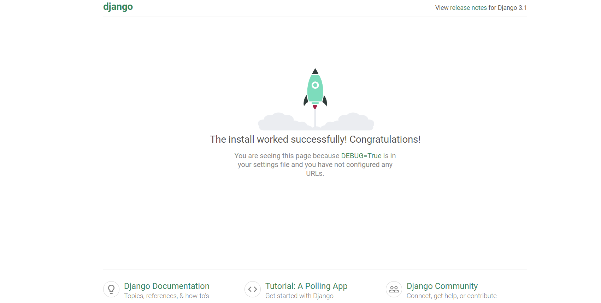
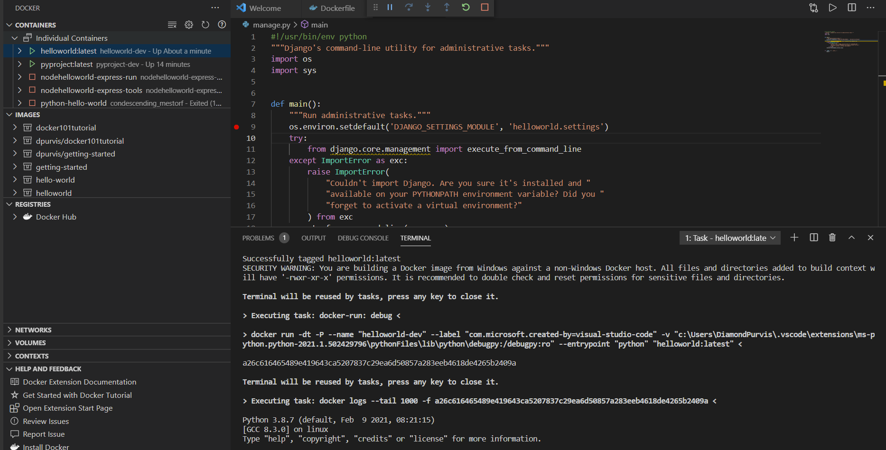
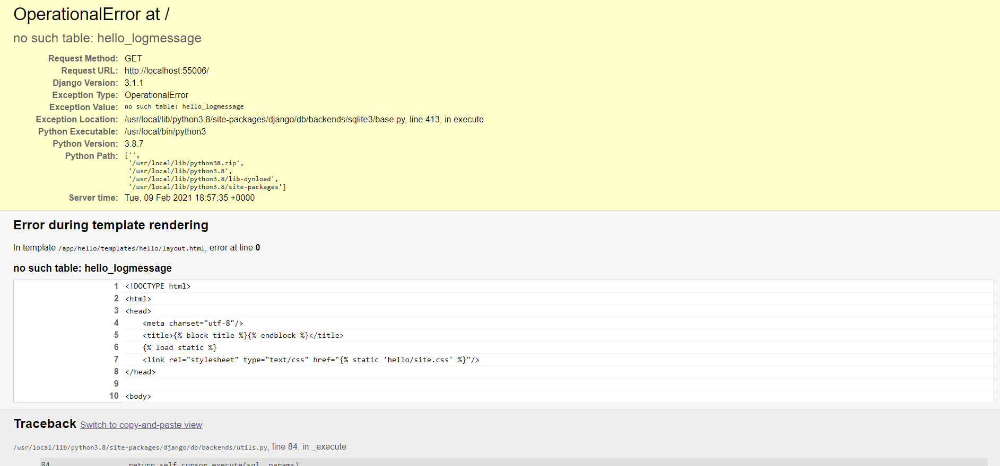
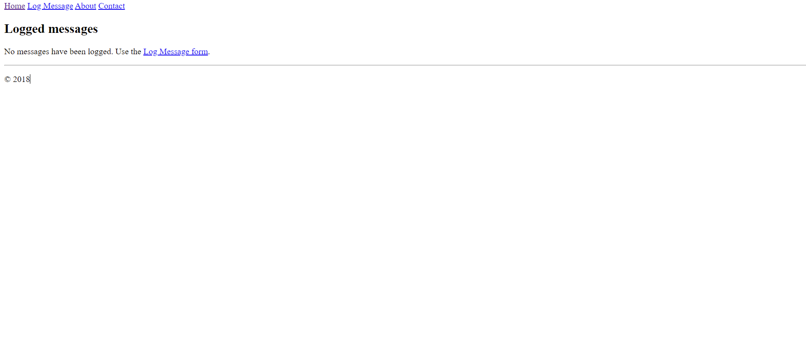
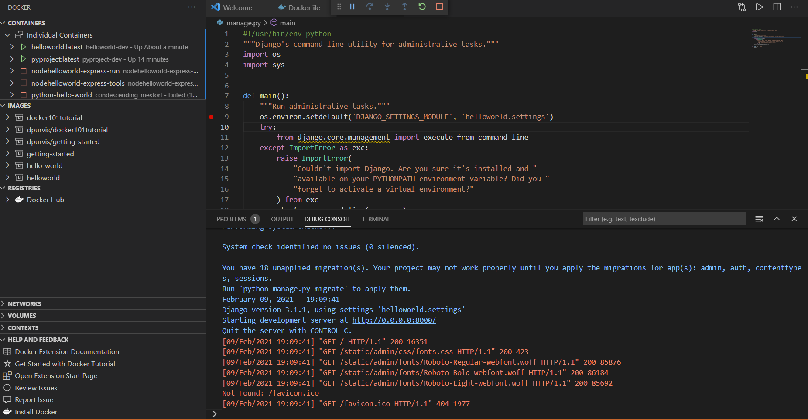

# Objective: Write python script, containerize it, run it

### Troubleshooting Issues
- Docker couldnt initialize
    - fix: update docker
    - enable virtualization in bios
        - outcome: hyper v works, docker initializes

- Cant find wgsi file
    - Identify folder and input the correct path into dockerfile

- Error rendering log message during docker build
    - Install django inside python env as well

- Rendering logs instead of launch page
    - didnt build docker image

## Steps to create program, build, and run


#### Create Python project
``` 
pip install django
django-admin startproject helloworld
cd helloworld
code .
```
#### Dockerize application

Add Docker files to the project
Open the project folder in VS Code.

Use command: Add Docker Files to Workspace... Python: Django
Trace it to manage.py with 8000 port

Select Yes to include Docker Compose files.
Docker extension creates the following files:
- A Dockerfile. 
- A .dockerignore file to reduce the image size by excluding files and folders that aren't needed such as .git, .vscode, and __pycache__.

- A docker-compose.yml and docker-compose.debug.yml file.

- A requirements.txt file for capturing all app dependencies.

#### Add an environment variable to the image#

Open the Dockerfile.

Underneath the EXPOSE statement, type Ctrl+Space to trigger IntelliSense and scroll to ENV.

Adding environment variable to Dockerfile

Then set the key to VAR1 and the value to 10.

Gunicorn is used as the default web server because it is a good starting point. It is referenced in the requirements.txt file as a dependency.

To use Gunicorn, it must bind to an application callable (what the application server uses to communicate with your code) as an entry point. This callable is declared in the wsgi.py file of a Django application. To accomplish this binding, the final line in the Dockerfile says:

```CMD ["gunicorn", "--bind", "0.0.0.0:8000", "{workspace_folder_name}.wsgi"]```


#### Build, run, and debug the container#
The Docker: Add Docker Files to Workspace... command automatically creates a Docker launch configuration to build and run container in debug mode. 

To debug Python app container:

Navigate to the manage.py file and set a breakpoint on this line:

```  os.environ.setdefault('DJANGO_SETTINGS_MODULE', 'helloworld.settings')```

Navigate to Run and Debug and select Docker: Python - Django.

Select Docker debug configuration and start 

```
The Docker image builds.
The Docker container runs.
The python debugger stops at the breakpoint in manage.py.
Step over this line once.
```

Navigate to the Debug Console and type os.environ["DJANGO_SETTINGS_MODULE"]

Once you view the output, press continue.

The Docker extension will launch your browser to a randomly mapped port and launch




#### Docker Explorer
The Docker Explorer provides an interactive experience to examine and manage Docker assets such as containers, images, and so on. To see an example:

In the Containers tab in explorer, you can right-click on your container view the logs of the container in the terminal.






